# Advanced-Linux-Commands
Darey.io project

## File Permissions and Access Rights

Understanding how to manage file permissions and ownership is crucial in Linux. This knowledge empowers you to control access to files and directories, ensuring the security and integrity of your system. Let's explore some essential commands and concepts related to file permissions and ownership.

In Linux, managing file permission and ownership is vital for controlling who can access, modify or execute files and directories. Understanding these concepts allows you to maintain the security and concepts related to file permissions and ownership.

## Numeric Representation of Permissions
In Linux, permissions are represented using numeric values. Each permission (no permission, resd, write, and execute) is assigned a numeric value:
- no permissions = 0
- reasd = 4
- write = 2, and
- execute = 1.

These values are combined to represent the permissions for each user class. Lets consider a few examples.
#### Permissions Represented by 7
- 4 (read) + 2 (write) + 1 (execute) = 7
- Symbolic: rwx
- Meaning: Read, write and execute permissions are all granted.
- Example Context5: A script file that the owner needs to read, modify and execute.

#### Permissions Represented by 5
- 4 (read) + 1 (execute) = 5
- Symbolic: r-x
- Meaning: Read and execute permissions are granted, but write permission is not.
- Example Context: A shared library or a command tool that users can execute and read but not modify.

#### Permissions Represented by 6
- 4 (read) + 2 (write) = 6
- Symbolic: rw-
- Meaning: Read and write permissions are granted, but execute permission is not.
Example Context: A document or a configuration file that the owner needs to read and modify but not execute. 

#### Shorthand Representation of Permissions**
In addition to the numeric way of showing permissions, Linux also has a shorthand, or symbolic method for representing file permissions.

#### Understanding User Classes From a Permissions Perspective
Before diving into shorthand permissions, it's important to understand the concept of "user classes" in the context of Linux permissions, Think of user classes as categories of users that Linux recognizes when deciding who can do what with a file. There are three main classes:
- Owner: The person who created the  file. Often referred to as 'user'
- Group: A collection of users who share certain permissions for the file.
- Others: Anyone else who has access to the computer but doesn't fall into the first two categories.

#### The Role Of Hyphens (-) in Permission Representation
When discussing permissions, you might notice hyphens (-) being mentioned. In the context of Linux file permissions, a hyphen doesn't actually represent a user class. Instead it is used in the symbolic representation of permissions to show the absence of a permission.

Let's get a bit practical with examples. Get onto your Linux teminal and run __ls -ltar__

Let's break it down to understand what each part means:

- In the output above, you will notice that some of the first characters can be a - or __d: d__ means it's a directory, __-__ means it's a file.
- The next three characters __(rwx)__ show the permissions for the owner. __r__ stands for read,-__w__ stands for write and __x__ stands for execute.
- If a permission is not granted, you'll see a - in its place (e.g, r-x means read andexecute permissions are granted but write permission is not). 
- The hyphen separates owner, group and others.
- The following three characters after the owner's permissions represent the group's permissions, using the same r, w and x notation.
- The last three characters show the permissions for others.

The order the user class is represented as follows;
- The first hyphen "-" is the __user__
- The second hyphen "-" is the __group__
- The third hyphen "-" is __others__

### File Permission Commands ###
To manage file permissions and ownership, Linux provides several commands:

### chmod command ###
The __'chmod'__ command allows you to modify file permissions. You can use both symbolic and numeric representations to assign permissions to the user, group and others.

Let's see an example.

Create an empty file using the __'touch'__ command 

Check the permission of the file

### What do you think the permission of the above output represent? ###
I think it represents that the user has __read(r)__ and __write(w)__ permissions but no __execute(x)__ permision.

Now let's update the permission so that all the user classes will have execute permission

The above command uses the chmod command with the __'+x'__ option to grant execute permission to the file __'script.sh'__. The __'x'__ option adds the execute permission to the existing permissions for all the user classes.

Now lets check what the file permissions look like 

The same command can be executed to achieve the same result using the numbers approach.

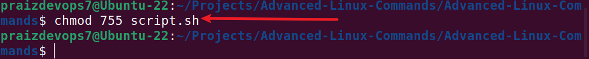

To add execute permissions for all (user, group, others), you would add 1 to each of the three categories, resulting in 755:
<ul>
<li>(4+2+1) = 7 for the user (read, write, and execute),</li>
<li>(4+1) = 5 for the group (read and execute),</li>
<li>(4+1) = 5 for others (read and execute).</li>
</ul>
Lets consider another example. Imagine the owner of a file is currently the only one with full permissions to <code>note.txt</code>.

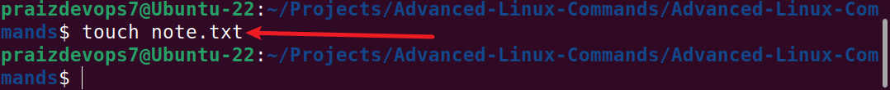

To allow group members and others to read, write, and execute the file, change it to the -rwxrwxrwx permission type, whose numeric value is 777:

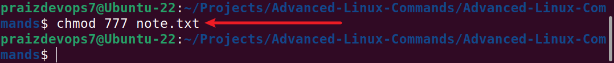

Check the output

Now, notice the dash ("-") in the first position represents the file type and not a user class. It indicates that the entry is a regular file.
<h5>chown command</h5>
The chown command allows you to change the ownership of files, directories, or symbolic links to a specified username or group.

Here’s the basic format:

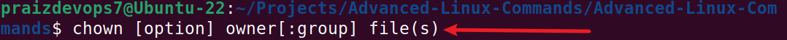

For example, lets assume there is a user on the server called <strong>"john"</strong>, a group on the server called <strong>"developers"</strong> and you want the owner of <code>filename.txt</code> changed from <strong>"dare"</strong> to <strong>"john"</strong>, and to also ensure that any user in the developer group has ownership of the file as well:

The command would look like below;

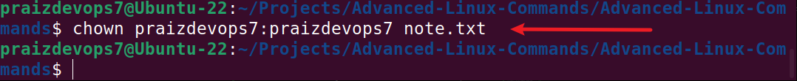

Check the output with <code>ls -latr</code> command on this file to then see the new changes.

<h3>Superuser Privilledges</h3>

It is often necessary to become the superuser to perform important tasks in linux, but as we know, we should not stay logged in as the superuser. In most linux distributions, there is a command that can give you temporary access to the superuser's privileges. This program is called sudo (short for super user) and can be used in those cases when you need to be the superuser for a small number of tasks. To use the superuser privilledes, simply type <code>sudo</code> before the command you will be invoking

To switch to the root user, simply run

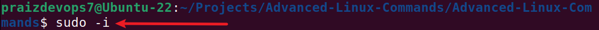

You can type <strong>'exit'</strong> to leave the shell

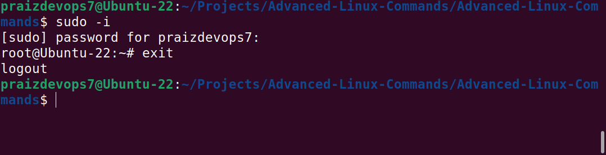

<h2 id="user-management-on-linux">User Management on Linux</h2>

As a DevOps engineer, you are also going to be doing systems administration which involves managing different users on the servers. You should know how to create a new user, or group, modify their permissions, update password and such similar tasks.

<h3>Creating a User</h3>

To create a new user on Ubuntu Server, you can use the <code>adduser</code> command. Assuming the name of the user to be created is <strong>joe</strong>. Open the terminal and run the following command:

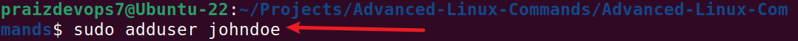

running this command will prompt you to enter and confirm a password for the new user. You will also be asked to provide some additional information about the user, such as their full name and contact information. Once you provide the necessary details, the user account will be created, and a home directory will be automatically generated for the user.

The home directory represents a file system directory created in the name of the user. Such as <code>/home/johndoe</code>. This is where each user created on the server will store their respective data.

<strong>Granting Administrative Privileges</strong>

By default, newly created user accounts do not have administrative privileges. To grant administrative access to a user, you can add the user to the sudo group. Users in the sudo group can run commands with administrative privileges. To the <strong>johndoe</strong> user to the sudo group, run:

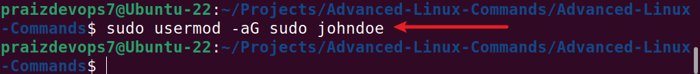

<ul>
<li><code>usermod:</code> This is a command that modifies user account properties.</li>
<li>-aG: These are flags used with the usermod command.
<ul>
<li>-a stands for "append" and is used to add the user to the specified group(s) without removing them from other groups they may already belong to.</li>
<li>-G stands for "supplementary groups" and is followed by a comma-separated list of groups. It specifies the groups to which the user should be added or modified.</li>
</ul>
</li>
<li>In the given command, <code>-aG sudo</code> is used to add the user <code>johndoe</code> to the <strong>sudo</strong> group.</li>
<li>The sudo group is typically associated with administrative or superuser privileges. By adding <code>johndoe</code> to the <code>sudo</code> group, the user gains the ability to execute commands with elevated privileges.</li>
</ul>

<strong>🛠️ Tasks for you:</strong>
<ul>
<li>Log out and log back in as the newly created user</li>

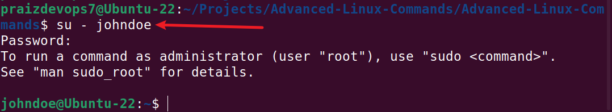

<li>Navigate to the <code>/home/johndoe</code> directory to explore what has been created. <strong>📌 Tip:</strong> Use the <code>cd</code> command.</li>

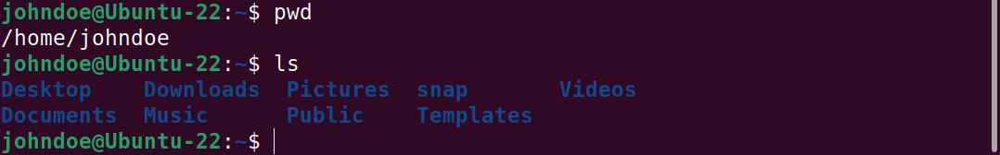
</ul>

<strong>Switching User Accounts</strong>

To start using the system as another user, you will need to use the <code>su</code> command to switch.

To switch to another user account, use the <code>su</code> command followed by the username. For example, to switch to the johndoe account, run:

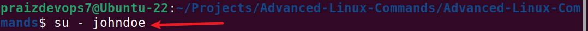

You will be prompted to enter the password for the user. Once authenticated, you will switch to the user's environment.

<h3>Modifying User Accounts</h3>

<strong>Changing User Password</strong>

To change the password for a user, use the <code>passwd</code> command followed by the username. For example, to change the password for <strong>johndoe</strong>, run:

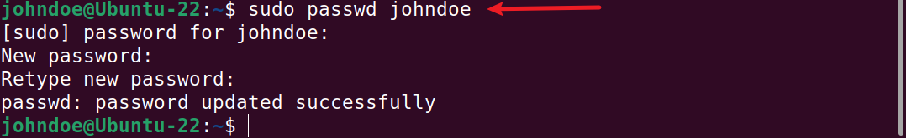

You will be prompted to enter and confirm the new password for the user.

<strong>🛠️ Tasks for you:</strong>
<ul>
<li>Test the updated password by logging on to the server, using the newly updated password.</li>

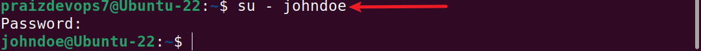
</ul>

<h3>Creating a Group</h3>
To create a new group, use the  <code>groupadd</code> command. For example, to create a group named "developers," use:

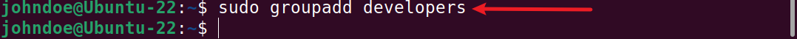

<h3>Adding Users to the Group</h3>

Use the <code>usermod</code> command to add users to the group. For instance, to add users "john" and "jane" to the "developers" group:

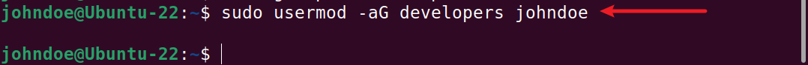

<ul>
<li>The <code>-aG</code> options append the "developers" group to the users' existing group memberships.</li>
</ul>

<h3>Verifying Group Memberships</h3>

To confirm the group memberships for a specific user, use the <code>id</code> command. For example, to check the group memberships for the user "johndoe":

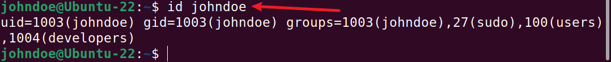

This command displays information about the user "johndoe," including the groups they belong to, such as "developers."

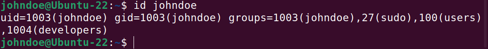

<h3>Deleting a User</h3>

To delete a user, run the command below

<h3>Ensuring Proper Group Permissions</h3>

Groups in Linux are often used to manage permissions for files and directories. Ensure that the relevant files or directories have the appropriate group ownership and permissions. For example, to grant the "developers" group ownership of a directory:

<pre class="relative"><button type="button" class="absolute right-2 top-1.5 flex items-center gap-1 rounded-md border border-blue-300 bg-inherit px-2 py-1.5 text-sm font-medium text-blue-300"><svg width="21" height="21" viewBox="0 0 21 21" fill="none" xmlns="http://www.w3.org/2000/svg"><path d="M15.3677 8.03125L17.3677 8.03125C17.92 8.03125 18.3677 8.47896 18.3677 9.03125L18.3677 16.0312C18.3677 17.1358 17.4722 18.0312 16.3677 18.0312L9.36768 18.0312C8.81539 18.0312 8.36768 17.5835 8.36768 17.0312L8.36768 15.0312M10.3677 2.03125L4.36768 2.03125C3.26311 2.03125 2.36768 2.92668 2.36768 4.03125L2.36768 10.0312C2.36768 11.1358 3.26311 12.0312 4.36768 12.0312L10.3677 12.0312C11.4722 12.0312 12.3677 11.1358 12.3677 10.0312L12.3677 4.03125C12.3677 2.92668 11.4722 2.03125 10.3677 2.03125Z" stroke="currentColor" stroke-width="1.5" stroke-linecap="round"></path></svg>Copy</button><code class="language-bash">sudo chown :developers /path/to/directory
</code></pre>

And to grant read and write permissions to the group:

<pre class="relative"><button type="button" class="absolute right-2 top-1.5 flex items-center gap-1 rounded-md border border-blue-300 bg-inherit px-2 py-1.5 text-sm font-medium text-blue-300"><svg width="21" height="21" viewBox="0 0 21 21" fill="none" xmlns="http://www.w3.org/2000/svg"><path d="M15.3677 8.03125L17.3677 8.03125C17.92 8.03125 18.3677 8.47896 18.3677 9.03125L18.3677 16.0312C18.3677 17.1358 17.4722 18.0312 16.3677 18.0312L9.36768 18.0312C8.81539 18.0312 8.36768 17.5835 8.36768 17.0312L8.36768 15.0312M10.3677 2.03125L4.36768 2.03125C3.26311 2.03125 2.36768 2.92668 2.36768 4.03125L2.36768 10.0312C2.36768 11.1358 3.26311 12.0312 4.36768 12.0312L10.3677 12.0312C11.4722 12.0312 12.3677 11.1358 12.3677 10.0312L12.3677 4.03125C12.3677 2.92668 11.4722 2.03125 10.3677 2.03125Z" stroke="currentColor" stroke-width="1.5" stroke-linecap="round"></path></svg>Copy</button><code class="language-bash">sudo chmod g+rw /path/to/directory
</code></pre>

<h4><strong>💡 Side Hustle Task 3 ⏱️:</strong></h4>
<ul>
<li>Create a group on the server and name it <code>devops</code></li>

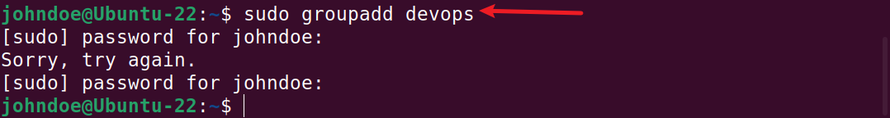

<li>Create 5 users <code>["mary", "mohammed", "ravi", "tunji", "sofia" ]</code>, and ensure each user belong to the devops group</li>

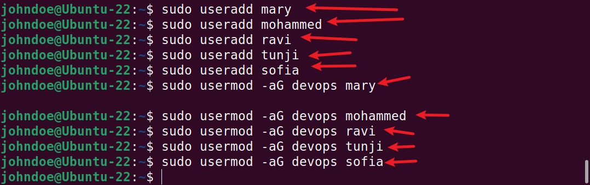

<li>create a folder for each user in the <code>/home</code> directory. For example <code>/home/mary</code></li>

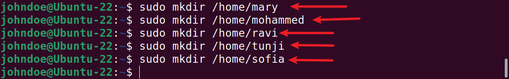

<li>Ensure that the group ownership of each created folder belongs to <strong>"devops"</strong>

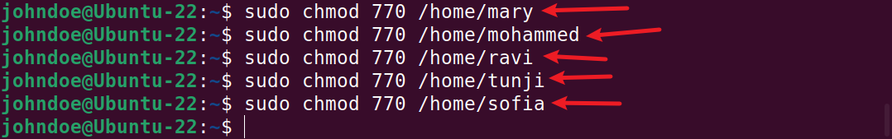
</li>
</ul>

